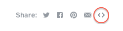
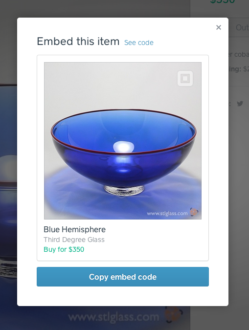

Square Market Item Embedding
============================

This repository contains examples for embedding items from
[Square Market][market] into your own website.

You can read more about embedding and sharing items in our
[Help Center][help-center].

Basic Embedding
---------------

You can find embed code on item pages throughout Square Market. Any item that is
for sale and has an image can be embedded. Start by clicking the embed icon
alongside our icons for sharing on Twitter, Facebook, etc:

The code shown can be copied and pasted into the HTML for your page:

Check the preview to see what the finished item will look like in your site:

Advanced Embedding
------------------

Browse the code in this repository for examples of different embedding
techniques, or view the source for our examples live in our
[github pages](https://square.github.io/square-market-embeds).

Our [favorite sample][masonry-sample] so far uses the Masonry library to create
a crisp, clean layout for a large number of embedded items.

Contributing
------------

We welcome your bug reports in the [issues][issues] section of this repository.

We also welcome new and improved examples. If you have an example that you'd
like to share with us:

1. Fork this repository
1. Create your feature branch (`git checkout -b my-new-example`)
1. Commit your changes (`git commit -am 'Add an example'`)
1. Push to the branch (`git push origin my-new-example`)
1. Create new Pull Request

We ask that contributors to the `square-market-embeds` repository first sign our
[Individual Contributor License Agreement (CLA)][cla].  It's a short form that
covers our bases and makes sure you're eligible to contribute.

License
-------

The samples here are made available to you under the Apache 2.0 [license](LICENSE).

The Masonry plug-in is used unmodified under the MIT license.

[market]: https://squareup.com/market
[help-center]: https://squareup.com/help/en-us/article/5168-share-items-from-square-market
[masonry-sample]: https://square.github.io/square-market-embeds/example-masonry
[cla]: https://spreadsheets.google.com/spreadsheet/viewform?formkey=dDViT2xzUHAwRkI3X3k5Z0lQM091OGc6MQ&ndplr=1
[issues]: https://github.com/square/square-market-embeds/issues
